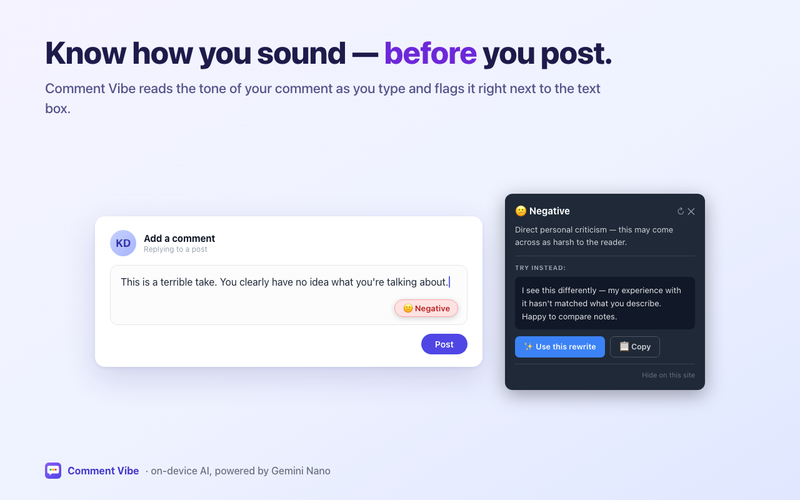

# Comment Vibe

A browser extension that uses on-device AI (Chrome's Gemini Nano, or Firefox's AI runtime) to analyse the tone of your comments in real time — before you hit post.

   

**▶ [Install from the Chrome Web Store](https://chromewebstore.google.com/detail/comment-vibe/kibcnjcipaofjlbbnjdjaobbkoajiejp)** · **[Install from Firefox Add-ons](https://addons.mozilla.org/firefox/addon/comment-vibe-on-device-check/)** · [Website](https://dzienko.dev/comment-vibe/) · [API playground](https://dzienko.dev/comment-vibe/playground/)



## What it does

Type a comment on LinkedIn, Twitter/X, YouTube, or any other site. A small badge appears near your text box showing the detected tone. Click it to see why — and if your comment sounds harsh or toxic, get an instant kinder rewrite suggestion you can copy in one click.

| Badge | Meaning |
|---|---|
| 😊 Positive | Constructive and friendly |
| 😐 Neutral | Balanced and factual |
| 😕 Negative | May come across as harsh or critical |
| 🚫 Toxic | Contains aggressive or harmful language |

## Privacy

All analysis runs locally — Chrome's on-device Gemini Nano model, or Firefox's on-device AI runtime. Your comments are never sent to any server.

## Firefox support

Firefox has no Prompt API. Instead, Comment Vibe uses the experimental
[WebExtensions AI API](https://firefox-source-docs.mozilla.org/toolkit/components/ml/extensions.html)
(`browser.trial.ml`, Firefox 134+), which exposes on-device Transformers.js
pipelines to extensions. Since that API offers classification pipelines rather
than a conversational model, the Firefox build runs a **multilingual zero-shot
tone classifier** (`Xenova/mDeBERTa-v3-base-xnli-multilingual-nli-2mil7`,
~340 MB q8, downloaded once, ~100 languages) in the extension's background
script — content scripts delegate to it via runtime messaging because the API
is not available to content scripts.

What differs from the Chrome experience:

| Feature | Chrome (Gemini Nano) | Firefox (`browser.trial.ml`) |
|---|---|---|
| Tone badge (positive/neutral/negative/toxic) | ✅ | ✅ |
| "Why" explanation | ✅ model-written sentence | ✅ classifier label + confidence |
| Kinder rewrite suggestion | ✅ | ❌ (no generation pipeline used) |
| Streaming (badge colors in early) | ✅ | ❌ (result arrives at once) |
| Output translated to the comment's language | ✅ | ❌ |

Setup on Firefox:

1. Firefox 134+ — on non-Nightly builds set `browser.ml.enable` and
   `extensions.ml.enabled` to `true` in `about:config`
2. [Install Comment Vibe from Firefox Add-ons](https://addons.mozilla.org/firefox/addon/comment-vibe-on-device-check/),
   open the popup, and click **Enable on-device AI**
   (grants the optional `trialML` permission and downloads the model once)

> ⚠️ `browser.trial.ml` is explicitly experimental — Mozilla may change it
> between major Firefox versions. The extension feature-detects it and fails
> quietly (no badge) when it's unavailable.

## Store assets

Chrome Web Store listing text and promo images (screenshots + tiles) live in [`store-assets/`](store-assets/). The PNGs are rendered from the HTML sources in `store-assets/src/` — edit those and run `store-assets/render.sh` (headless Chrome) to regenerate. See [`store-assets/listing.md`](store-assets/listing.md) for the description text and the asset → store-slot mapping.

Firefox (addons.mozilla.org) assets live in [`store-assets/firefox/`](store-assets/firefox/): Firefox-accurate listing text in [`store-assets/firefox/listing.md`](store-assets/firefox/listing.md) and four screenshots rendered from `store-assets/firefox/src/` via `store-assets/firefox/render-firefox.sh`. The copy and images deliberately drop the rewrite/multilingual claims, which the Firefox build does not have.

---

## Playground — try every built-in AI API

The [`playground/`](playground/) folder is a standalone static site for exploring **all** of Chrome's built-in AI APIs (Prompt, Summarizer, Translator, Language Detector, Writer, Rewriter, Proofreader) in one place: status, version history, links, a live "will it work for you?" check, and an interactive demo per API.

**Live:** https://dzienko.dev/comment-vibe/playground/ &nbsp;(deployed from `playground/` via GitHub Pages; the site root serves the product landing page from `site/`)

Run it locally:

```bash
cd playground && python3 -m http.server 8000   # → http://localhost:8000
```

> Note: the **Prompt API** is stable on the open web since Chrome 148, so on Chrome 148+ it works with no token or flag. Writer, Rewriter, and Proofreader are still in trial and may not be available.

---

## Chrome AI availability — what you need to know

> **TL;DR — the Prompt API is now stable for Chrome Extensions (Chrome 138+). Most users need no flags; Chrome just downloads the Gemini Nano model on first use.**

### Current status

The **Prompt API** (the `LanguageModel` API that powers this extension) reached **stable for Chrome Extensions in Chrome 138**, and **stable on the open web in Chrome 148**. Inside an extension it is no longer behind a flag — the previous `chrome://flags` dance was only needed during the origin-trial period (Chrome 127–137). As of Chrome 149 (current stable) the API works for everyone on supported hardware without tokens or flags.

What a user needs today:

1. **Chrome 138 or later**, desktop only (Windows 10/11, macOS 13+, or Linux)
2. Hardware that meets the Gemini Nano minimums (see below)
3. The model downloaded — Chrome fetches it automatically the first time the API is used; no flags required

| Built-in AI API | Status (Chrome 149, June 2026) | Used here |
|---|---|---|
| Prompt API (`LanguageModel`) | ✅ Stable — extensions (Chrome 138), open web (Chrome 148) | ✅ Yes — core sentiment/rewrite engine |
| Summarizer | ✅ Stable (Chrome 138) | ⏳ Roadmap (thread context) |
| Translator | ✅ Stable (Chrome 138) | ✅ Yes — translates output to the comment's language |
| Language Detector | ✅ Stable (Chrome 138) | ✅ Yes — detects the comment's language |
| Rewriter | 🧪 Developer trial | ⏳ Roadmap (better rewrites) |
| Writer | 🧪 Developer trial | — Not needed |
| Proofreader | 🧪 Origin trial | ⏳ Roadmap (grammar layer) |

> **Note on namespaces:** the legacy `window.ai.languageModel` namespace is deprecated in favour of the global `LanguageModel`. This extension still probes both (`content.js`, `popup.js`) so it keeps working on older builds that only expose the legacy path — see `CLAUDE.md`.

### Hardware requirements

Gemini Nano runs on your device. Chrome enforces these minimums:

| Requirement | Minimum |
|---|---|
| Operating system | Windows 10/11 · macOS 13 (Ventura)+ · Linux |
| Free disk space | 22 GB (model is removed if space drops below 10 GB) |
| GPU VRAM | More than 4 GB |
| RAM | 16 GB or more |
| CPU cores | 4 or more |
| Mobile | ❌ Not supported (Android / iOS) |

---

## Setup

On **Chrome 138+** with eligible hardware, no setup is required — install the extension and Chrome handles the model download on first use. The steps below are only needed on **older builds (Chrome 127–137)** or if the popup reports the AI as unavailable.

### Step 1 — Verify it worked

Click the Comment Vibe icon in the Chrome toolbar. The popup should show **Chrome AI ready ✓**. If so, you're done.

### Step 2 — (Older builds only) Enable the flags

1. Open `chrome://flags`
2. Search for **Prompt API for Gemini Nano** → set to **Enabled**
3. Search for **Summarization API for Gemini Nano** → set to **Enabled** (needed on some builds)
4. Click **Relaunch**

### Step 3 — Force the model download

1. Open `chrome://components`
2. Find **Optimization Guide On Device Model**
3. Click **Check for update** and wait for the download to finish

The model is ~2–4 GB and downloads silently in the background. If the popup still shows "not available" afterward, restart Chrome fully (quit and reopen, not just close the tab) and try again.

> **Note on the on-device model:** Chrome downloads Gemini Nano (the "Optimization Guide On Device Model" component) automatically on eligible hardware. In May 2026 this drew [criticism](https://www.tomsguide.com/ai/check-your-storage-chrome-may-be-downloading-a-4gb-ai-model-heres-what-we-know) for happening without a clear consent prompt; Chrome settings now let you disable and remove the model, and you can inspect its status at `chrome://on-device-internals`. Comment Vibe uses this same model — it never downloads anything itself.

---

## Roadmap

### Near-term
- [ ] **Proofreader API** (🧪 origin trial) — layer grammar and spelling fixes on top of tone analysis
- [ ] **Streaming** — switch to `promptStreaming()` so the badge updates as the model responds instead of waiting for the full result
- [ ] **Keyboard shortcut** — manually trigger analysis instead of waiting for the debounce

### Medium-term
- [x] **Language Detector + Translator API** (✅ shipped in 1.1.0) — detects the comment's language and translates the badge label, reason, and rewrite into that language so the suggestion is directly pasteable. Falls back to English when a language pair is unavailable.
- [ ] **Context-aware analysis** — read the post being replied to and factor it into the tone judgement ("measured reply to an aggressive post" vs "unprovoked attack")
- [ ] **Personal vibe stats** — popup dashboard showing positive/neutral/negative breakdown over 7 and 30 days, stored locally via `chrome.storage`
- [ ] **Platform tone calibration** — stricter system prompt on LinkedIn, more relaxed on Reddit, different norms per domain

### Longer-term
- [ ] **Rewriter API** — *only if it reaches stable.* It ran a full origin trial (Chrome 137–148) but reverted to a flag-only developer trial instead of graduating, and it overlaps heavily with what the Prompt API already does well. Not worth a dependency today; revisit behind a capability check if it ships stable, keeping the Prompt rewrite as the default.
- [ ] **Summarizer API** (✅ stable since Chrome 138) — summarise a long comment thread before the user replies so the suggestion accounts for the full context
- [ ] **Proactive coaching** — suggest how to phrase something before you start typing, based on the post topic and thread mood (Summarizer + Prompt working together)
- [ ] **Multimodal** — once the Prompt API image/audio input stabilises: analyse screenshots pasted into comments, or audio in voice-to-text boxes

---

## Development

### Load the extension locally

1. Clone or download this repo
2. Open `chrome://extensions`
3. Enable **Developer mode** (top-right toggle)
4. Click **Load unpacked** → select the `comment-vibe` folder

### Generate icons

Open `icons/make-icons.html` in Chrome and click **Download all icons**. Move the three downloaded PNG files into the `icons/` folder.

### Project structure

```
comment-vibe/
├── manifest.json       # Extension manifest (MV3)
├── CHANGELOG.md        # Versioned release notes
├── content.js          # Detects comment boxes, runs AI analysis, localises, renders badge
├── content.css         # Badge and tooltip styles
├── popup.html          # Toolbar popup
├── popup.js            # Popup — checks Chrome AI availability
├── popup.css           # Popup styles
└── icons/
    ├── icon16.png
    ├── icon48.png
    ├── icon128.png
    └── make-icons.html # Canvas-based icon generator
```

### Build for the Chrome Web Store

From inside the project folder:

```bash
zip -r comment-vibe.zip . -x "*.DS_Store" -x "*.zip" -x "*.git*"
```

## How it works

1. A `MutationObserver` watches for comment boxes matching site-specific selectors (LinkedIn's Quill editor, Twitter's tweet textarea, YouTube's comment field) plus generic `contenteditable` and `textarea` fallbacks across all other sites
2. Text changes are debounced (900 ms) to avoid calling the model on every keystroke
3. The text is sent to a `LanguageModel` session (Chrome's Prompt API) using few-shot examples + prefix prompting to force structured JSON output from Gemini Nano
4. The JSON response is parsed and normalised — the `normalize()` function maps any alternative key names the model invents back to the expected schema
5. In parallel, the **Language Detector API** identifies the comment's language. If it isn't English, the **Translator API** translates the label, reason, and rewrite into that language (cached per language pair). This is best-effort — any failure falls back to the English result
6. A fixed-position badge appears at the bottom-right corner of the input, coloured by sentiment
7. Clicking the badge opens a dark tooltip with the reason and (for negative/toxic results) a rewrite suggestion with a one-click copy button

## License

MIT
